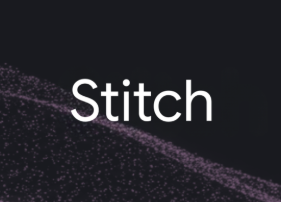

# Day 11 構造改善計画（Cursor実装用）

## 問題の本質
現在のDay11は**テキストの壁**。動画の解説がアコーディオンの中に長文で詰め込まれており、IT初心者が「結局この動画で何が分かるの？」を**視覚的に一瞬で掴めない**。テキストを増やすのではなく、**構造で理解させる**改善が必要。

---

## 改善方針：3つの柱

1. **「動画の中身マップ」を新設** — 各動画の内容を `compare-table` や `step-strip-sakura` で構造化し、長文アコーディオンを廃止
2. **「Web制作 vs アプリ開発」比較を `compare-table` 化** — 現在の縦積み `column-box` ×2 を、横並び比較テーブル1つに凝縮
3. **ツール進化マップを新設** — Day10→11の学習の流れを `diagram-steps` で可視化し、各ツールの位置づけを一目で把握できるようにする

---

## 改善A：タブ1「本日の目標」の構造改善

### A-1. Web制作 vs アプリ開発 → `compare-table` に置換

**現状の問題**: `column-box` が2つ縦に並んでおり、比較が直感的でない。

**改善**: vol03〜07で実績のある `.compare-table` を使い、**1つの表で横並び比較**する。

`.compare-table` のCSSは vol11-1.html に未定義なので、vol03-1.html L109-112 から以下をコピーして `<style>` 内に追加：

```css
.compare-table { width: 100%; border-collapse: separate; border-spacing: 0; margin: 2rem 0; border-radius: 16px; overflow: hidden; border: 1px solid #fbcfe8; box-shadow: 0 8px 25px rgba(216,27,96,0.05); }
.compare-table th { background: var(--accent-bg); color: var(--accent); font-weight: 900; padding: 1.5rem 1.2rem; text-align: left; font-size: 1.1rem; border-bottom: 2px solid #f8bbd0; }
.compare-table td { padding: 1.5rem 1.2rem; border-bottom: 1px solid #fce4ec; color: var(--text-main); line-height: 1.7; background: #fff; }
.compare-table tr:hover td { background: #fffbfd; }
```

**HTMLの置換対象**: L1849〜L1872の `column-box` ×2 を削除し、以下に置換：

```html
<div class="compare-table-wrapper" style="overflow-x:auto;">
    <table class="compare-table">
        <thead>
            <tr>
                <th style="width:25%;"></th>
                <th style="background: linear-gradient(135deg, #fdf2f8, #fce7f3); color:#be185d;">
                    <i class="fa-solid fa-palette" style="margin-right:6px;"></i> Web制作（Day 7〜10）
                </th>
                <th style="background: linear-gradient(135deg, #eff6ff, #dbeafe); color:#1e40af;">
                    <i class="fa-solid fa-gears" style="margin-right:6px;"></i> アプリ開発（Day 11〜）
                </th>
            </tr>
        </thead>
        <tbody>
            <tr>
                <td><strong>ひと言で</strong></td>
                <td>📄 見せるだけの<strong>ポスター</strong></td>
                <td>⚙️ 動く<strong>システム</strong></td>
            </tr>
            <tr>
                <td><strong>例え</strong></td>
                <td>会社案内のパンフレット</td>
                <td>電卓・チャットボット・予約フォーム</td>
            </tr>
            <tr>
                <td><strong>ユーザーは</strong></td>
                <td>読む・見る・リンクをクリック</td>
                <td><strong>入力 → 結果を受け取る</strong></td>
            </tr>
            <tr>
                <td><strong>裏側の技術</strong></td>
                <td>HTML / CSS（見た目だけ）</td>
                <td>API連携（<strong>AIの脳みそを借りる</strong>）</td>
            </tr>
            <tr>
                <td><strong>データ</strong></td>
                <td>固定（書いた通りのまま）</td>
                <td>リアルタイムに変化する</td>
            </tr>
        </tbody>
    </table>
</div>
```

### A-2. 「今日の進行ステータス」3カードはそのまま維持
L1874〜L1890 の `.bento-grid` は簡潔で良い。変更不要。

---

## 改善B：タブ2「前半」の構造改善

### B-1. 長文アコーディオンを「動画の中身マップ」カードに置換

**現状の問題**: アコーディオン内が `<p>` と `<ul>` の長文テキスト。開いても「結局何の話？」が分かりにくい。

**改善**: アコーディオンを廃止し、各動画の直下に **`step-strip-sakura`（番号付きステップカード）** を使った「この動画で学べること」を配置。1ステップ＝1行で、**スキャンだけで内容が把握できる**ようにする。

**動画①の直下に配置するHTML**（L1953〜L1965のアコーディオンを置換）：

```html
<div class="glass-card" style="border-top: 3px solid #2563eb; padding:1.5rem 2rem;">
    <h4 style="margin:0 0 0.75rem; color:#1e40af; font-size:1.1rem;">
        <i class="fa-solid fa-map" style="color:#2563eb; margin-right:8px;"></i>
        動画①で学べること（3つのポイント）
    </h4>
    <ol class="step-strip-sakura">
        <li><strong>1</strong> <b>AI Studioとは</b> — Geminiの高性能AIモデルを<b>無料で</b>テスト・操作できる開発者向けコンソール</li>
        <li><strong>2</strong> <b>APIキーとは</b> — あなたのアプリとGoogleのAI頭脳を繋ぐ「鍵（パスワード）」。これがないとアプリは空っぽの箱のまま</li>
        <li><strong>3</strong> <b>裏側の仕組み</b> — ChatGPTもGeminiも、裏ではAPIキーを使ってAIサーバーに質問を投げて答えを受け取っている</li>
    </ol>
</div>
```

**動画②の直下に配置するHTML**（L1967〜L1979のアコーディオンを置換）：

```html
<div class="glass-card" style="border-top: 3px solid #2563eb; padding:1.5rem 2rem;">
    <h4 style="margin:0 0 0.75rem; color:#1e40af; font-size:1.1rem;">
        <i class="fa-solid fa-map" style="color:#2563eb; margin-right:8px;"></i>
        動画②で学べること（3つのポイント）
    </h4>
    <ol class="step-strip-sakura">
        <li><strong>1</strong> <b>Build機能</b> — AI Studioに搭載された「日本語で指示→即アプリ生成」の神機能。コーディング知識ゼロでOK</li>
        <li><strong>2</strong> <b>実演トップ5</b> — 動画内で業務効率化アプリを5つ、プロンプトから完成まで<b>ノーカット</b>で実演</li>
        <li><strong>3</strong> <b>常識の崩壊</b> — 「アプリ開発＝難しいプログラミング言語」という思い込みが完全に覆る体験</li>
    </ol>
</div>
```

### B-2. APIキー図解セクション — 図解そのものは良いが、補足テキストを圧縮

**現状**: L1982〜L2017 の `.diagram-box` + `.diagram-steps` + `.alert-warn` は視覚的で良い。
**改善**: 図解の下の補足テキスト（L2009-L2011）を1行に圧縮。alert-warnの長文も2行以内に。

図解下部テキストを以下に短縮：
```html
<p style="margin:0.75rem 0 0; color:var(--text-main); font-size:0.95rem; line-height:1.7; text-align:center;">
    💡 あなたのアプリ＝<strong>頭脳を持たない入れ物</strong>。APIキーで<strong>Googleの頭脳を借りて</strong>賢くなる。
</p>
```

alert-warnを以下に短縮：
```html
<div class="alert-warn">
    <h4><i class="fa-solid fa-triangle-exclamation"></i> ⚠️ APIキーは絶対に他人に見せない</h4>
    <p>GitHub公開やSNS投稿で漏れると、<strong>第三者に使われて高額請求</strong>が発生します。管理方法は動画内で解説されています。</p>
</div>
```

---

## 改善C：タブ3「後半」の構造改善

### C-1. Stitch / GenSpark の bento-item を「機能比較テーブル」に統合

**現状の問題**: bento-item が2つ縦に並び、それぞれ長文の `<p>` で説明。2つのツールの違いが直感的に掴めない。

**改善**: 2つの bento-item（L2075〜L2096）を1つの `compare-table` に置換。

```html
<div class="compare-table-wrapper" style="overflow-x:auto; margin-top:1.5rem;">
    <table class="compare-table">
        <thead>
            <tr>
                <th style="width:22%;"></th>
                <th style="background:linear-gradient(135deg, #f5f3ff, #ede9fe); color:#5b21b6;">
                     Stitch
                </th>
                <th style="background:linear-gradient(135deg, #faf5ff, #f3e8ff); color:#7e22ce;">
                    <i class="fa-solid fa-wand-magic-sparkles" style="margin-right:6px;"></i> GenSpark
                </th>
            </tr>
        </thead>
        <tbody>
            <tr>
                <td><strong>ひと言で</strong></td>
                <td>AIに画面デザインを作らせる</td>
                <td>AIにスマホアプリを丸ごと作らせる</td>
            </tr>
            <tr>
                <td><strong>入力</strong></td>
                <td>「こんな画面が欲しい」とテキスト入力</td>
                <td>「こんなアプリが欲しい」と<b>会話</b></td>
            </tr>
            <tr>
                <td><strong>出力</strong></td>
                <td>綺麗なUI部品＋<b>そのまま使えるコード</b></td>
                <td><b>iOS / Android 対応のスマホアプリ</b></td>
            </tr>
            <tr>
                <td><strong>動画内の実例</strong></td>
                <td>テキスト指示だけでアプリ画面を自動生成</td>
                <td>「英単語帳アプリ」を会話だけで構築（正答率トラッキング付き）</td>
            </tr>
            <tr>
                <td><strong>すごい点</strong></td>
                <td>デザイン→コード変換の手間がゼロ</td>
                <td>プログラミング知識ゼロでストア公開レベル</td>
            </tr>
        </tbody>
    </table>
</div>
```

### C-2. 動画③④の直下にもステップカード追加

動画③（Stitch）の直下：
```html
<div class="glass-card" style="border-top: 3px solid #7c3aed; padding:1.5rem 2rem;">
    <h4 style="margin:0 0 0.75rem; color:#5b21b6; font-size:1.1rem;">
        <i class="fa-solid fa-map" style="color:#7c3aed; margin-right:8px;"></i>
        動画③で学べること
    </h4>
    <ol class="step-strip-sakura" style="--tier-beginner:#7c3aed;">
        <li><strong>1</strong> Stitchに「こんな画面を作って」とテキストで指示するだけでUIデザインが生成される</li>
        <li><strong>2</strong> 生成されたデザインは画像ではなく<b>そのまま動くコード</b>として出力される</li>
        <li><strong>3</strong> デザイン→開発の「翻訳作業」がゼロになり、アイデアから即プロトタイプが完成</li>
    </ol>
</div>
```

動画④（GenSpark）の直下：
```html
<div class="glass-card" style="border-top: 3px solid #a855f7; padding:1.5rem 2rem;">
    <h4 style="margin:0 0 0.75rem; color:#7e22ce; font-size:1.1rem;">
        <i class="fa-solid fa-map" style="color:#a855f7; margin-right:8px;"></i>
        動画④で学べること
    </h4>
    <ol class="step-strip-sakura" style="--tier-beginner:#a855f7;">
        <li><strong>1</strong> GenSparkに「英単語帳アプリを作って」と話しかけるだけでスマホアプリが構築される</li>
        <li><strong>2</strong> スワイプ操作・正答率トラッキングなど<b>本格的な機能</b>が会話だけで実装される</li>
        <li><strong>3</strong> iOS / Android 両対応でストア公開レベルまで到達可能</li>
    </ol>
</div>
```

### C-3. 「知識ゼロでもアプリが世に出せる時代」ボックスを圧縮

L2099-L2105 の `.highlight-box` 内テキストを以下に短縮：
```html
<p style="margin:0; line-height:1.85; color:#3b0764;">
    <strong>Bolt.new</strong>（Webアプリ）→ <strong>AI Studio</strong>（API連携アプリ）→ <strong>Stitch + GenSpark</strong>（スマホアプリ）。<br>
    この3層で、「作りたい！」がプログラミング知識なしで全て形になります。
</p>
```

---

## 改善D：ツール進化マップの新設（タブ1 or タブ3の末尾）

Day10〜11で登場するツールの**位置づけを一目で把握**できる `diagram-steps` スタイルのフローを、タブ3の比較テーブルの上に新設。

```html
<div class="diagram-box" style="background: linear-gradient(135deg, #faf5ff, #fff); border-color:#ddd6fe;">
    <h4 style="margin:0 0 1rem; color:#5b21b6; font-weight:900;">
        <i class="fa-solid fa-layer-group" style="margin-right:8px;"></i>
        ツールの進化マップ — 何がどこまでできる？
    </h4>
    <div class="diagram-steps">
        <div class="diagram-step" style="background:linear-gradient(135deg, #fdf2f8, #fce7f3); border-color:#fbcfe8;">
            <i class="fa-solid fa-bolt ds-icon" style="color:#d81b60;"></i>
            <div class="ds-title" style="color:#be185d;">Bolt.new</div>
            <p style="margin:0; color:var(--text-sub); font-size:0.85rem;">Webアプリを<br>自動生成</p>
        </div>
        <div class="diagram-arrow"><i class="fa-solid fa-arrow-right"></i></div>
        <div class="diagram-step" style="background:linear-gradient(135deg, #eff6ff, #dbeafe); border-color:#bfdbfe;">
            <i class="fa-solid fa-flask ds-icon" style="color:#2563eb;"></i>
            <div class="ds-title" style="color:#1e40af;">AI Studio</div>
            <p style="margin:0; color:var(--text-sub); font-size:0.85rem;">API連携で<br>AIの頭脳を搭載</p>
        </div>
        <div class="diagram-arrow"><i class="fa-solid fa-arrow-right"></i></div>
        <div class="diagram-step" style="background:linear-gradient(135deg, #f5f3ff, #ede9fe); border-color:#ddd6fe;">
            <i class="fa-solid fa-palette ds-icon" style="color:#7c3aed;"></i>
            <div class="ds-title" style="color:#5b21b6;">Stitch</div>
            <p style="margin:0; color:var(--text-sub); font-size:0.85rem;">UIデザインを<br>即コード化</p>
        </div>
        <div class="diagram-arrow"><i class="fa-solid fa-arrow-right"></i></div>
        <div class="diagram-step" style="background:linear-gradient(135deg, #faf5ff, #f3e8ff); border-color:#e9d5ff;">
            <i class="fa-solid fa-wand-magic-sparkles ds-icon" style="color:#a855f7;"></i>
            <div class="ds-title" style="color:#7e22ce;">GenSpark</div>
            <p style="margin:0; color:var(--text-sub); font-size:0.85rem;">スマホアプリ<br>まで自動生成</p>
        </div>
    </div>
</div>
```

---

## 改善E：レスポンシブ追加

`.compare-table` のモバイル対応を `@media (max-width: 768px)` 内に追記：
```css
.compare-table th, .compare-table td { padding: 0.8rem 0.6rem; font-size: 0.85rem; }
.compare-table-wrapper { margin: 1rem -0.5rem; }
```

`step-strip-sakura` に `--tier-beginner` のCSS変数オーバーライドが効くよう、`.step-strip-sakura strong` のbackgroundを `var(--tier-beginner, #f59e0b)` に変更。

---

## 実装手順（Cursor向け）

1. **CSS追加**: `.compare-table` 4行を `<style>` 内に追加、`.step-strip-sakura strong` の background を `var(--tier-beginner, #f59e0b)` に変更
2. **タブ1**: L1849-L1872 の `column-box` ×2 を `compare-table` に置換（改善A-1）
3. **タブ2**: L1953-L1979 のアコーディオン×2 を `step-strip-sakura` カード×2 に置換（改善B-1）
4. **タブ2**: L2009-L2017 の補足テキスト＋alert-warnを圧縮（改善B-2）
5. **タブ3**: 動画③④の直下（video-gridの閉じタグ直後）に `step-strip-sakura` カード×2 を追加（改善C-2）
6. **タブ3**: L2075-L2096 の `bento-item` ×2 を `compare-table` に置換（改善C-1）
7. **タブ3**: 比較テーブルの上にツール進化マップを追加（改善D）
8. **タブ3**: L2099-L2105 のhighlight-boxテキストを圧縮（改善C-3）
9. **レスポンシブCSS追加**（改善E）

## 絶対に守ること
- **Facadeパターン厳守**: 動画の `video-grid` / `vc-thumb` / `data-video-id` は一切触らない
- **Sticky Video**: `.video-grid` のCSS（L1778-L1788）は変更しない
- **ナビゲーションボタン**: 各タブ末尾の `bottom-nav` は変更しない
- **ミッションエリア**: タブ4の `.mission-area` は変更しない
- **新規CSSクラスは追加しない**: 既存の `.compare-table` / `.step-strip-sakura` / `.diagram-steps` のみ使用
